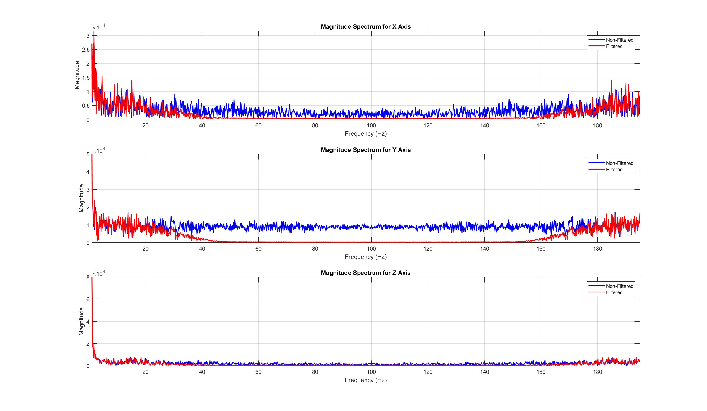

# Filter Design in STM32 for Filtering IMU Data

This project implements a Lowpass FIR filter on the STM32 microcontroller to filter IMU (Inertial Measurement Unit) data. The filter design is based on the CMSIS DSP library.

## Filter Specifications

### 10th Order Filter
- **Passband**: 15 Hz
- **Stopband**: 50 Hz

### 7th Order Filter
- **Passband**: 5 Hz
- **Stopband**: 30 Hz

## Documentation

1. **Gathering Sensor Data**: 
   - The raw accelerometer data for the 3-axis is located in `docs/data/raw_cmps_acc_x_y_z.csv`.

## Step 2:  **Processing the Data**: 
   - The data was processed using the script located in [`docs/matlab/main_filter_design.m`](docs/matlab/main_filter_design.m). 
   - The results of the filter design are saved as images:
     - For the 7th order filter with a passband of 5 Hz and a stopband of 30 Hz: 
       - 
     - For the 10th order filter with a passband of 15 Hz and a stopband of 50 Hz: 
       - 
       

## Step 3: **Obtaining Filter Coefficients**: 
   - The coefficients of the designed filters have been calculated and will be used in the STM32 code implementation.
   - 7th Order:
     - coeff = [0.0714, 0.1030, 0.1455, 0.1711, 0.1711, 0.1455, 0.1030, 0.0714]
   - 10th Order:
     - coeff = [-0.0220, -0.0339, 0.0072, 0.1235, 0.2618, 0.3244, 0.2618, 0.1235, 0.0072, -0.0339, -0.0220]
## Step 4: Code Architecture for Filtering

The code architecture for filtering IMU data using a Lowpass FIR filter on the STM32 microcontroller is organized into several key components:

1. **Library Inclusions**:
   - The project utilizes the **CMSIS DSP library** (["arm_math.h"](Middlewares/ST/ARM/DSP/Inc/arm_math.h)) for efficient digital signal processing operations, particularly for implementing the FIR filter.
   - The **CMPS12 library** (["cmps12.h"](lib/include/cmps12.h)) is included to facilitate communication with the CMPS12 sensor, which provides accelerometer and gyroscope data.

   ```c
   #include "arm_math.h"  // CMSIS DSP library for signal processing
   #include "cmps12.h"    // CMPS12 library for sensor data
   ```

2. **FIR Filter Initialization**:
   - The FIR filter instances are initialized using the coefficients defined for the 7th and 10th order filters. The "arm_fir_init_f32" function from the CMSIS library is used to set up the filter instances for each axis of the accelerometer and gyroscope.

   ```c
   // FIR filter coefficients for 7th order
   float32_t fir_coefficients[FIR_LENGTH] = {0.0714, 0.1030, 0.1455, 0.1711, 0.1711, 0.1455, 0.1030, 0.0714};

   // Initialize FIR filter instances
   arm_fir_init_f32(&fir_instance_accel_x, FIR_LENGTH, fir_coefficients, fir_state_accel_x, 1);
   ```

3. **Data Processing Loop**:
   - In the main loop, raw sensor data is read from the CMPS12 sensor.
   - The FIR filter is applied to the accelerometer and gyroscope data using the "arm_fir_f32" function, which processes the input data and produces filtered output.

   ```c
   // Read raw sensor data
   accel_x = CMPS12_GetAccelX(&cmps12);
   // Apply FIR filter to accelerometer data
   fir_in_accel_x = (float32_t)accel_x;
   arm_fir_f32(&fir_instance_accel_x, &fir_in_accel_x, &fir_out_accel_x, 1);
   filtered_accel_x = fir_out_accel_x;  // Store the filtered accelerometer x
   ```

4. **Data Transmission**:
   - The filtered data is formatted into a string and transmitted over USART for further analysis or logging.

   ```c
   // Prepare the data to send over USART
   char data_buffer[200];  // Buffer to hold the formatted string
   int len = snprintf(data_buffer, sizeof(data_buffer), "x_f %.2f y_f %.2f z_f %.2f\r\n", filtered_accel_x, filtered_accel_y, filtered_accel_z);
   HAL_UART_Transmit(&huart1, (uint8_t*)data_buffer, len, HAL_MAX_DELAY);
   ```

## Step 5: CMPS12 Data Handling

The **CMPS12 library** provides a structured way to interact with the CMPS12 sensor, which is essential for obtaining accelerometer and gyroscope data. The library includes functions to:

- **Initialize the Sensor**: The "CMPS12_Init" function sets up the I2C communication with the sensor.

   ```c
   CMPS12_Init(&cmps12, &hi2c2);  // Initialize the CMPS12 sensor
   ```

- **Read Sensor Data**: Functions such as "CMPS12_GetAccelX", "CMPS12_GetAccelY", "CMPS12_GetGyroX", etc., are used to retrieve raw accelerometer and gyroscope data from the sensor.

   ```c
   int16_t accel_x = CMPS12_GetAccelX(&cmps12);  // Get accelerometer X data
   int16_t gyro_x = CMPS12_GetGyroX(&cmps12);    // Get gyroscope X data
   ```

- **Calibration and Offset Management**: The library also includes functions for calibration and managing offsets, ensuring accurate readings.

## Step 6: Implementing the DSP with CMSIS Library

The **CMSIS DSP library** provides a comprehensive set of functions for digital signal processing, including FIR filtering. Here’s how the implementation works:

1. **FIR Filter Coefficients**: 
   - The coefficients for the FIR filter are defined based on the filter design specifications. For example, the 7th order filter coefficients are initialized in the "fir_coefficients" array.

   ```c
   float32_t fir_coefficients[FIR_LENGTH] = {0.0714, 0.1030, 0.1455, 0.1711, 0.1711, 0.1455, 0.1030, 0.0714};
   ```

2. **Filter Instance Initialization**:
   - Each filter instance for the accelerometer and gyroscope axes is initialized using the "arm_fir_init_f32" function. This function takes the filter length, coefficients, state buffer, and a scaling factor as parameters.

   ```c
   arm_fir_init_f32(&fir_instance_accel_x, FIR_LENGTH, fir_coefficients, fir_state_accel_x, 1);
   ```

3. **Filtering Process**:
   - The filtering is performed in the main loop where raw sensor data is read. The "arm_fir_f32" function is called with the filter instance and input data to compute the filtered output. This function processes the input sample and updates the state buffer automatically.

   ```c
   arm_fir_f32(&fir_instance_accel_x, &fir_in_accel_x, &fir_out_accel_x, 1);
   filtered_accel_x = fir_out_accel_x;  // Store the filtered accelerometer x
   ```

## Step 7: Workflow Summary and Expected Results

The overall workflow of the project can be summarized as follows:

1. **Data Acquisition**: Raw accelerometer and gyroscope data is gathered from the CMPS12 sensor using the CMPS12 library.
2. **Data Processing**: The raw data is processed through the FIR filter implemented using the CMSIS DSP library. The filtering helps to remove high-frequency noise and smooth the sensor readings.
3. **Data Transmission**: The filtered data is formatted and transmitted over USART for further analysis or logging.

## Step 8: Frequency Domain Results Using FFT and Analysis

The results of the filtering process were analyzed in the frequency domain using the Fast Fourier Transform (FFT). The frequency domain results for the 7th and 10th order filters are shown in the following images:

- **7th Order Filter Frequency Response**: 
- **10th Order Filter Frequency Response**: 

The frequency response graphs display the filtered and non-filtered accelerometer data for the X, Y, and Z axes. Each plot contains two lines:
- **Red Line**: Represents the filtered data.
- **Blue Line**: Represents the non-filtered data.

The results indicate that the filtering process was successful, as the graphs show a significant reduction in the amplitude of frequencies outside the specified passband (PB) and stopband (SB) specifications of the filters. 

- For the **7th order filter**, the passband is set to 5 Hz, and the stopband is at 30 Hz. Frequencies above 30 Hz are effectively attenuated, demonstrating the filter's ability to remove unwanted high-frequency noise.
- For the **10th order filter**, with a passband of 15 Hz and a stopband of 50 Hz, similar results are observed, with frequencies above 50 Hz being significantly reduced.

The missing frequency components in the filtered data correspond to the frequencies that fall outside the defined passband and stopband specifications, confirming that the filters are functioning as intended.

## Step 9: Phase Delay Analysis

The phase delay introduced by the filters is another important aspect of the filtering process. The phase delay results for the 7th and 10th order filters are shown in the following images:

- **7th Order Phase Delay**: 
- **10th Order Phase Delay**: 

The phase delay plots illustrate how the filters affect the timing of the signal components. Each plot consists of three graphs corresponding to the X, Y, and Z axes. 

- **Observation**: As the order of the filter increases, the phase delay also increases. This is a common characteristic of FIR filters, where higher-order filters tend to introduce more phase shift in the output signal.
- The phase delay is crucial in applications where timing is important, as it can affect the synchronization of the filtered signals with other data sources.

In summary, the phase delay results indicate that while the filters effectively attenuate unwanted frequencies, they also introduce a certain amount of delay, which must be considered in the overall system design and data interpretation.

---

This concludes the analysis of the results obtained from the filtering process. The successful filtering of IMU data, along with the analysis of frequency response and phase delay, demonstrates the effectiveness of the implemented FIR filters on the STM32 platform.


